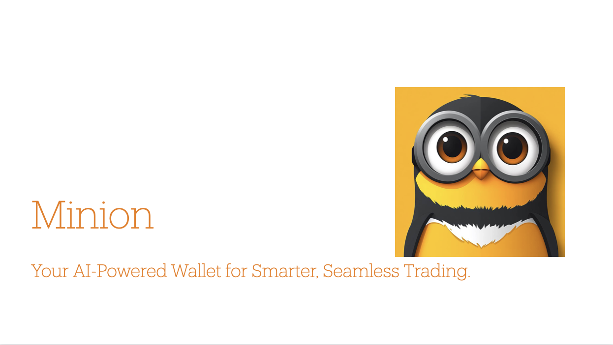

# Minion

 

 

Minion is a smart wallet designed for mass adoption, supporting iOS, Android, web app, and Telegram. It leverages AI to analyze on-chain liquidity pools, staking pools, and other financial data, helping users select trading strategies tailored to their holdings and experience. By utilizing data from The Graph Protocol—such as pool_id, timestamp, pairs, liquidity, 24h trading volume, fee rates, prices, and APY—Minion's AI makes optimal degen decisions based on your wallet and trading history. After each trade, users can choose to donate to the Freedom of Press foundation, with a shareable banner provided for social media.

